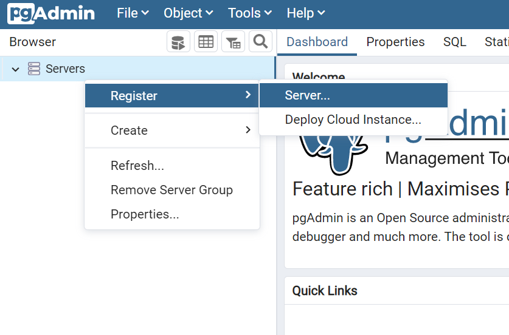
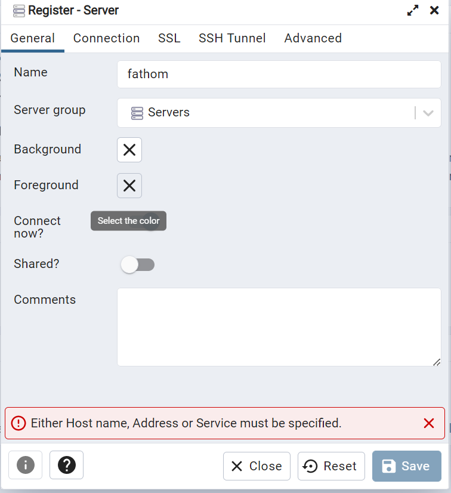
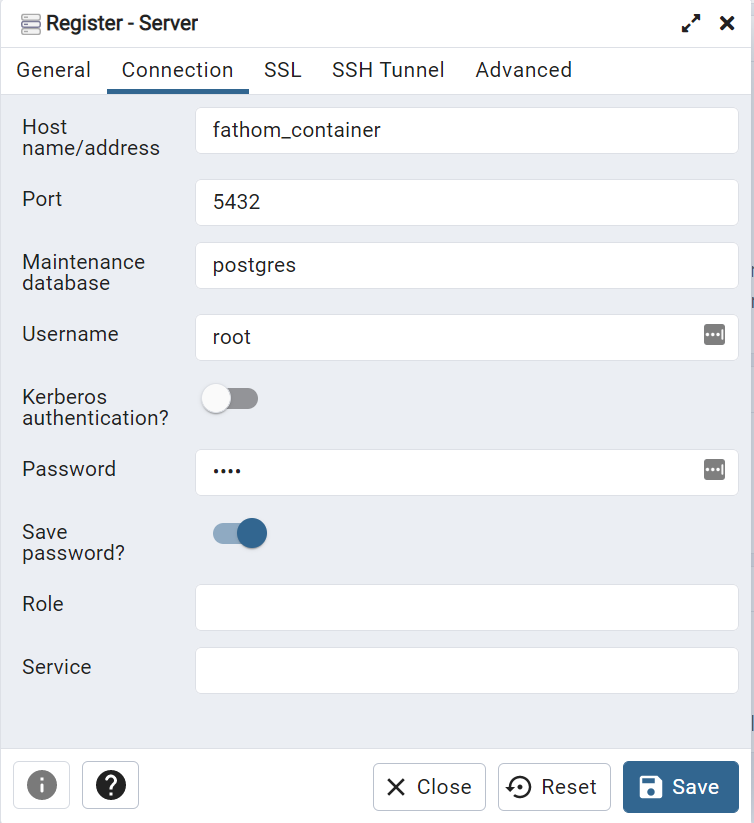
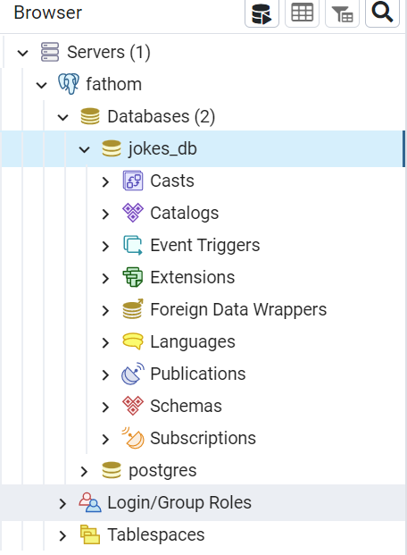

# fathom-jokes

App I've made as a technical task for an interview.

# How to Run

Go to the Postgresql section below to initialize the DB first.
App is set up as a monorepo, you can find the api and the ui folders.
UI can be ran with `npm start`.
API can be run with either `npm run dev` for development or `npm start` for real build.
In order to configure the DB see the Install Postgres section, however once it's installed you can run it using `docker compose up` after navigating to the `api/db/init` folder. I strongly recommend using docker desktop for simplicity.

# Install Postgres with Docker

You will need Docker in order to use this. I'm going to document on the assumption that you have docker installed and basic knowledge of docker.
I won't assume knowledge over the concepts, but that you know how to use it and you know how to use a bash shell.

We will use a Docker compose file for our db init. You can find the `docker-compose.yml` inside `api/db/init`.

Navigate to the folder and run `docker compose up`. If everything went fine, you should be able to go to `localhost:5050` and you shuold see the pgAdmin login page. Login using admin@admin.com and root as a password.

We will need some manual steps.
Please follow the following steps:
Go to server and add a new server



Create the server with the following configuration. It's provided in the docker compose file we created earlier. User and password is `root`




You should now have a fathom group with a jokes_db on postgresql.



To recap, now we have the SQL DB and our json data is located on `api/db/pg-data`, so in order to migrate the data from our JSON file to our DB we need to run a script that will insert the data in the DB. All of these could be just simplified and add the data into a Non relation db, but following the test requirement we are asked to do in a SQL. I found this process to be the most demonstrative of some of my expertise.

PLEASE NOTE that the data in this project is the same that was provided but modified. I had to escape single quote characters and on top of that the id 189 was duplicated, so I changed on of the entries to id=388. I suggest using the data from the project instead of the provided, else it won't work.

The insert script consists of

```
INSERT INTO jokes
SELECT *
FROM json_populate_recordset (NULL::jokes,
' JSON_DATA');
```

Where `JSON_DATA` is the whole content in the file, with the array opening and closing brackets. Below it will be the script with 1 item in the array for the sake of not polluting the Readme file, but please copy all the content of the `jokes.json` file and add it to the script

Run the following script in the jokes_db:

```
CREATE TABLE jokes
(
	id INT NOT NULL PRIMARY KEY,
	 type VARCHAR(255) NOT NULL,
	 setup VARCHAR(255) NOT NULL,
	 punchline VARCHAR(255) NOT NULL
);
GO
INSERT INTO jokes
SELECT *
FROM json_populate_recordset (NULL::jokes,
/* PLEASE COPY THE CONTENT OF THE JOKES.JSON FILE AND ADD IT HERE, ELSE YOU WILL CREATE ONLE 1 ITEM*/
' [
  {
    "id": 1,
    "type": "general",
    "setup": "What did the fish say when it hit the wall?",
    "punchline": "Dam."
  }
]');

```

Now you should have your DB initialized with all the data, the api and ui can now be installed and ran correctly.

# API Architecture

For the API I decided to go with a very simplified version of an onion/hexagonal architecture.
We are declaring (and decoupling) our repositories, so we have interfaces that will get implemented. These implementations will inject the interfaces in order to obtain our layer of abstraction. This way we could change our implementations with minimal effort.

Again, this was done for the sake of demonstrating capabilities, for a real world project of this scope, this is overkill.

In order to achieve this pure decoupling, I decided to use `injection-js`.
This could be achieved similarly with NestJS.

The API connects to Postgres using `node-postgres`. You can find the `db_connect.ts` class where we do a generic init so we don't need to connect to the db everysingle time we access a repo_impl class, avoiding code duplication.

# UI Architecture

For the UI I went with the minimum I thought necessary to achieve what is asked. That is a website at it's core, a html file, js script and css.
In order to run it, you can navigate to the index.html file and manually open it in a browser or use the `npm start` command, which will only run a live-server that will open the same file. I used it as it has hot reload, which is really useful for development.

I used jQuery as per the requirements, however the code is simple enough to not require the use of it.
It also doesn't have bootstrap, it's pure CSS. Outise jQuery, it only has fontawesome for a nice info icon and google's roboto font.

As the main focus of the website is to display a joke, I didn't want to go with anything fancy that would override the scope of this, I want to be very clear and concise. Go to the website, get a joke, click the website/joke and get the punchline, laugh.
I thought about making different type of website, even including a menu to obtain all jokes, but I decided it was irrelevant. If this was a real product, we would only care about the user getting the joke with minimal intrusion, hence I decided to just do that, to get a joke.
